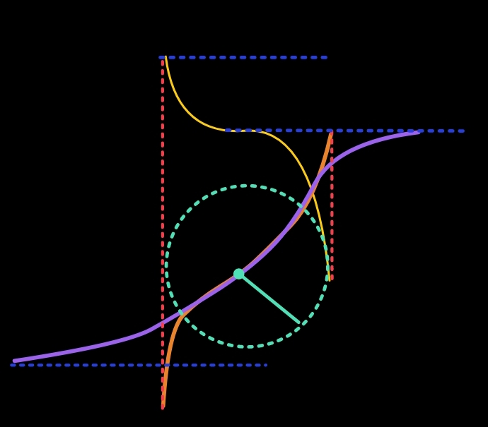
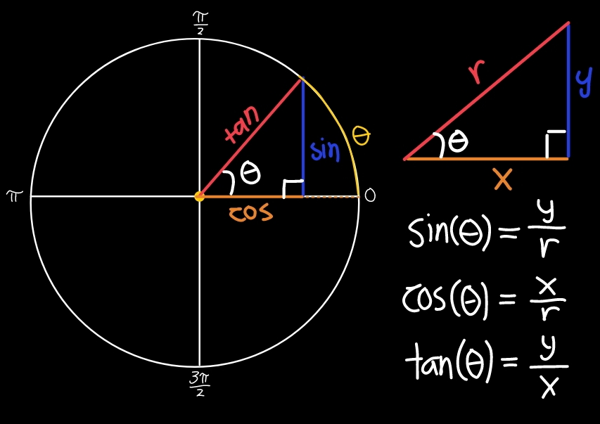

 

# Inverse Trigonometric Derivations

**
 Layered Graphs 
**

 This repository contains geometric and mathematical derivations of inverse trigonometric functions from arcsine to arccosine to arctangent. This repository also serves as a student-guide book to the beauty of inverse trigonometric functions as long as the license's followed

Furthermore, these derivations are almost purely from the author's own thinking rather than finding textbooks and simplifying it, you may find my unique style of communication peculiar, interesting, or strange. In one last addition to these, you might find certain corners of the repository to contain citations and images, know that it is to usually expand on the idea being discussed. 

**
 — Author's Note 
**

## *Trigonometric Three's Nature*

 
 The three, standard trigonometric functions: Sine, Cosine, and Tangent, their use in right triangles were inevitable, but this isn't Pythagorean all over again, it's about their graphs; Beyond what most were taught, the author seeks to show you how circles help you graph the three.

