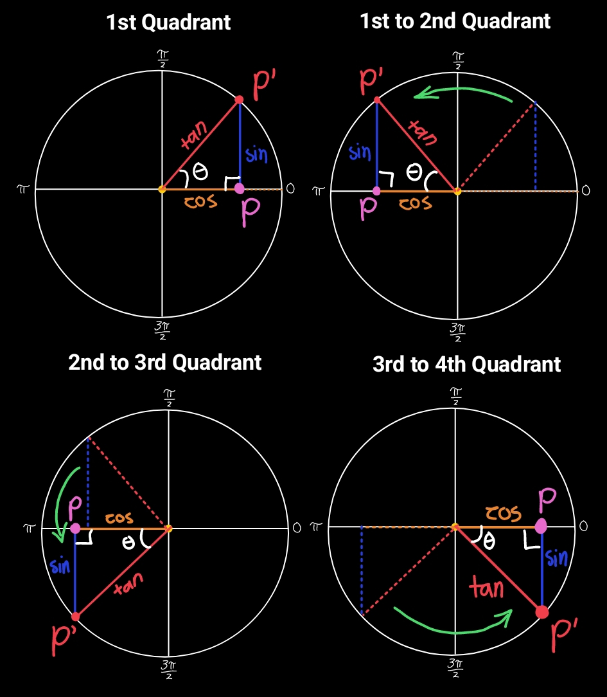
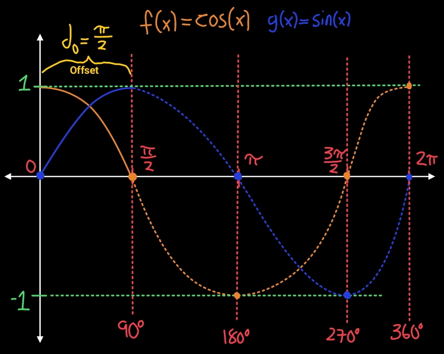
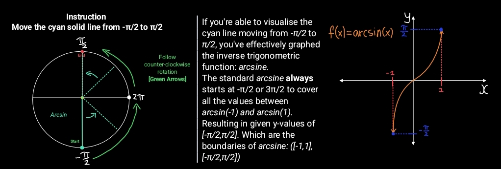
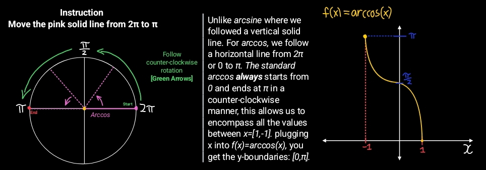
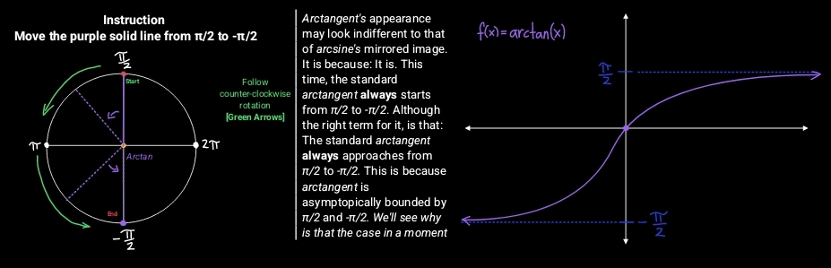
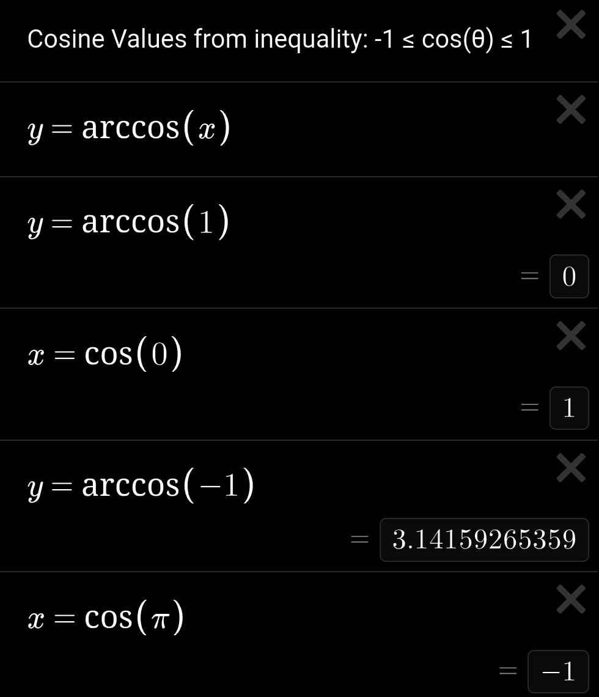
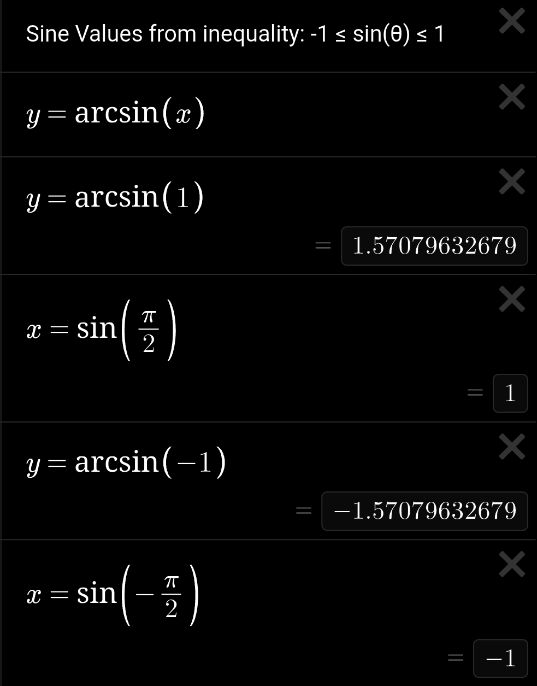

 

# Inverse Trigonometric Derivations

**
 Layered Graphs 
**

 This repository contains geometric and mathematical derivations of inverse trigonometric functions from arcsine to arccosine to arctangent. This repository also serves as a student-guide book to the beauty of inverse trigonometric functions as long as the license's followed

Furthermore, these derivations are almost purely from the author's own thinking rather than finding textbooks and simplifying it, you may find my unique style of communication peculiar, interesting, or strange. In one last addition to these, you might find certain corners of the repository to contain images, know that it is to usually expand on the idea being discussed.
**What should I expect?**
• Expect in-depth explanations, visualizations, metaphors, maybe even video visualizations made by me, once I learned how to do so.
• Semi-formal style, expect many *jargons*, technical terms.
• Expect this to assume the reader already has previous experience in dealing with trigonometric functions most of the time.

**
 — Author's Note — 
**

## *Trigonometric Three's Nature*

 
 The three, standard trigonometric functions: Sine, Cosine, and Tangent, their use in right triangles were inevitable, but this isn't Pythagorean all over again, it's about their graphs; Beyond what most were taught, the author seeks to show you how circles help you graph the three.

But, for the sake of context, I added trigonometric ratios, if you remembered that x corresponds to the adjacent side, and the y corresponds to the opposite side, whilst radius(r) is the hypotenuse. All with respect to the reference angle theta(θ), x also corresponds to cosine, likewise, y corresponds to sine, and radius(r) corresponds to tangent, whilst that yellow theta(θ) is what you call the arclength, in this case, the arclength is just the reference angle's angle. Later, you'll be seeing alot of these, to understand what we're truly doing here, you must understand or remember what we've done here. After this, we'll go over the rotation of that triangle with respect to the center of the circle, and it's relationships with the graphs of sine, cosine, and tangent.

 

## *Sine, Cosine, Tangent function graphs*

**
 4—Frame Rotation 
**

The illustration above shows a right triangle moving in a counter-clockwise manner, from the 1st quadrant to the 4th, totalling a full rotation: 2π or 360⁰, and it assumes the circle's centered at *[0,0]* with its radius as one. Here, the sides are clarified as sine, cosine, tangent, and you may spot points, preferably P and P'.

**Graphing Sine and Cosine**

Both two points are coloured, in the illustration above, P is pink and P' is red.
The pink point[P] only traverse values between *x=[1,-1]* whilst the red point[P'] traverse all values associated with the circumference of said circle.
Following the red point, from its starting position at *(1,0)* towards *π/2* or *(0,1)*, this is the first 90⁰ rotation, and following the pink point[P]: The boundaries of a standard sine and cosine function is *y=(1,-1)* which means cosine starts at its highest at *x=1*, but as we approach *x=0* or the center of the circle, cosine reaches its inflection point whilst sine is at it's highest, likewise, at *x=0* where cosine is highest, at this point: Sine is at its inflection point. To summarize, cosine's highest point is at *(1,0)* whereas sine's highest point is located at *(π/2,1)*, which just explains why the cosine function is offsetted by π/2 to the left:

*cos(x) = sin(x+π/2)*

**The illustration below highlights the offset between**
**the graph of sine and cosine**

## The properties of arcsine, arccosine, and arctangent

These three trigonometric functions are inverses of their counterparts, preceded by a prefix of *arc-". You may remember that trigonometric functions, when used, gives you the length of a side, likewise, to invert that, you must take the arc function, therefore giving you the angle of your referenced angle in a triangle.
These functions also has boundaries like their counterparts, each boundaries are:

*arcsine –    y = (π/2, -π/2), x = (1, -1).*

*arccosine –  y = (0, π), x = (1, -1).*

*arctangent – y = [π/2, -π/2], x = (∞, -∞).*

**Arcsine's Boundary**

As the image states, if you are able to move that line from *-π/2* to *π/2* you've effectively graphed the arcsine, well, first off: Why is arcsine's y-component boundary *-π/2* and *π/2* in the first place? 
The answer roots down to it's standard trigonometric counterpart: Sine. We know from our very first functional illustration or the second one for that matter, that the *sin(θ)* when calculated, gives you the length of the quotient of the opposite side, and the hypothenuse. *Theta's* value is always between *0* to *2π* in radians, since anything that goes beyond *2π* generally repeats back in a full circle.
With that triangle metaphor once more, at *π/2*, your opposite and hypotenuse are the same in terms of length: *sin(x) = y, where x = θ, y = o/H*. So, at *π/2 : y=1, if radius is also r=1*
or: *sin(π/2) = 1/1: π/2 = arcsin(1/1)*. Likewise for *-π/2: if sin(-π/2) = -(1/1), then -π/2 = arcsin(-(1/1))*. 
Why is this relevant you might ask? Well it is because the x values of *-π/2 to π/2* is sufficient to cover all y values from (-1, 1), if you start at y=-1, sweeping to *2π* relative to a full circle, in a counter-clockwise rotation, and COMPLETELY stop at y=1, you've graphed arcsine.
Fortunately, the other two: Arccosine, arctangent, has similar properties. Next one this is going towards is about arccosine and it's properties.

**Arccosine's Boundary**

Similar to arcsine, but arccosine sweeps horizontally from *2π or 0* to *π*. Again why is our arccosine's boundary that way?
Similarly once more, remember that *cos(y) = x or cos(θ) = a/H*. Treat this equation independently from their trigonometric counterpart to avoid variable overload. Unlike sine's: sin(x) = y, cosine is flipped to be horizontal, switching the variables in place.
Coming back to that triangle metaphor, the line starts completely flat from the center to *x=1* or it lies completely flat at *2π or 0, say 0*. In this instance, your radius, or hypothenuse's length is indifferent from the adjacent's. Assuming the length of our radius is *r=1*, we find that our adjacent's length in this instance is also *a=1*.
Therefore, *cos(0) = 1/1: 0 = arccos(1/1)*, conversely, when *cos(π) = -(1/1): π = arccos(-(1/1))*. Hence it's domain of (1,-1) from it's range of (0, π), the trace stops COMPLETELY at *x = -1* from *x = 1* with a counter-clockwise rotation, once it sweeps from that once, it will yield the function arccosine, it is sufficient because it captures all values between the domain of *(1,-1)*, the sweep captures all the given length values relative to your radius. It is also appropriate to know that arccosine's inflection point is at *y = π/2*, in other words, the moment where it crosses from the 1st quadrant to the 2nd quadrant relative to our circle. Also, from this point onwards, we will use domain, and range to signal [x,y]. Your x-axis is your domain, conversely your y-axis is your range. The next and arguably the last in this series of standard trigonometric functions is arctangent, which may look surprisingly similar to arcsine's flipped starting point, and mirrored version.

**Arctangent's Boundary**

Arctangent now starts from *π/2* towards *-π/2*, if you were to take that purple line and let it sweep counter-clockwise towards *-π/2* ONCE, you've derived the graph of the arctangent function. Again, taking from the boundary of a tangent function such that: *m = ∆y/∆x* where *m = tan(θ), ∆y = sin(θ), ∆x = cos(θ)* yields *tan(θ)* from the point-slope formula. At *-π/2 ≤ θ ≤ π/2* cos(θ) is zero when θ is exactly -π/2 or π/2* that creates an asymptote at *(x_1, x_2) = (π/2,-π/2)* of the arctangent function.
Now, **WHY** do we choose our boundaries to be *-π/2 ≤ θ ≤ π/2* starting at *π/2* counter-clockwise to *-π/2*. Again, if you remember, inverse trigonometric functions allows you to take the angle *θ*, or any arbitrary angle *α* from two side's magnitude: *θ = arctan(y/x)* where both independent sine and cosine's output cannot be greater 1 and less than -1. *-1 ≤ (sin(θ), cos(θ)) ≤ 1* this is shown by the two images below from Desmos graphing calculator:

Well, this one and the next can easily be understood using the unit circle with the right triangle inscribed with respect to the center, where it was stated that: *sin(θ) = O/H* assume new variables (x,y), let *θ = y | x = O/H* we find that: *(O/H , θ), x = sin(y) | y = arcsin(x)*, for the function θ(y) = arcsin(x) plug in *(π/2, -π/2)*, and find the corresponding function x = sin(θ(y))  values.

Similarly to sine, we can understand this property with the same method: Assume new variables (x,y), let *cos(θ) = A/H* where θ is a function of y: θ(y), and A/H as a function x yields *y = arccos(x) & x = cos(y)*
plug in *(π/2, -π/2)* for the function θ(y) = arccos(x) and find the corresponding function x = cos(y)'s value.

 

